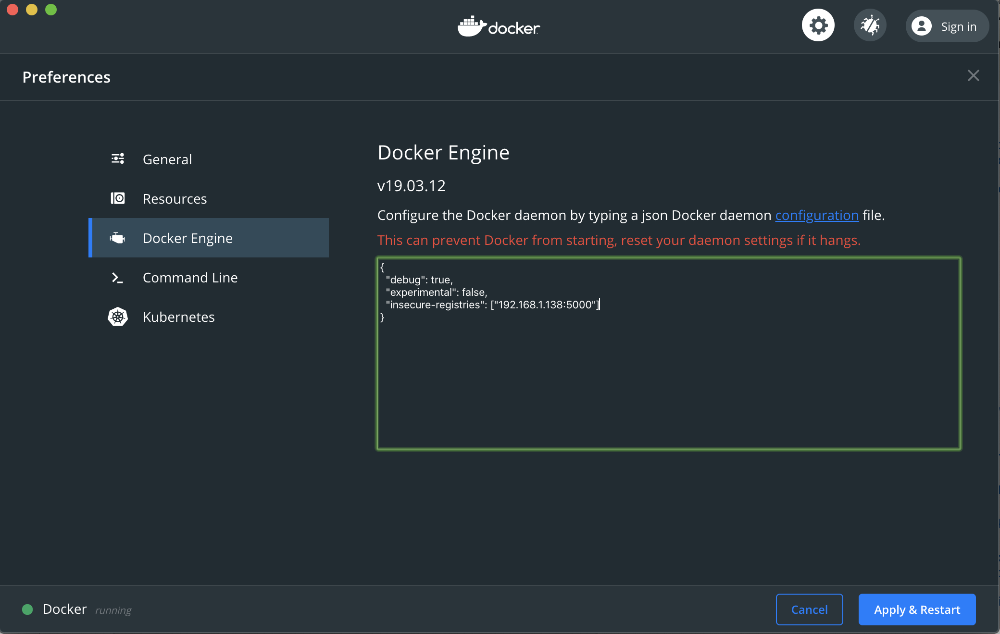
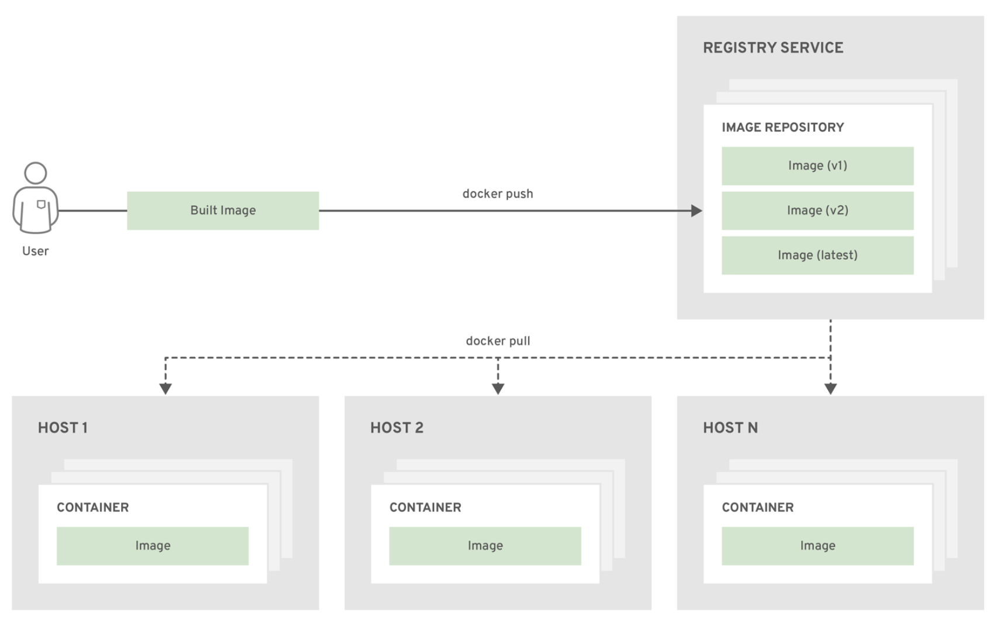

<br>

## Main

1. [Install Ubuntu 18.04.5 LTS SERVER](#download)
2. [Login to Master and Node](#login)
3. [Add your rsa.pub on Master and Node](#authorized_key)
4. [Create ssh config on Your Local PC](#ssh_config)
5. [Access on Master and Node via ssh](#ssh_access)
6. [Install k8s Cluster on Master](#k8s-master-miro)
7. [Set static IP on Master](#set_static_ip_on_master)
8. [Install k8s on Node01](#k8s-node01-miro)
9. [Set static IP on Node01](#set_static_ip_on_node01)
10. [Setup kubectl on Local PC](#kubectl)
11. [Test a yaml busybox](#test_yaml_busybox)
12. [Create Docker Registry on Master or other Vm](#docker_registry)
13. [Use Docker to Build images on Master registry](#use_docker)
14. [K8s create new namespace](#k8s_namespace)
15. [Create kubernetes dashboard](#kubernetes-dashboard)
16. [Using Helm - The package manager for k8s](#helm_chart)
17. [Some usefull kubectl commands](#kubectl_cmd)
18. [Renew k8s expire certificates](#update_k8s_certs)
19. [ShutDown Master - Nodes Vm](#shutdown)

<br>

## Download

Download and install `Ubuntu 18.04.5 LTS SERVER` edition from [here](https://www.ubuntu-it.org/download), one Vm for `Master` another one for `Node`.

[ [ back ] ](#main)

<br>

## Login


- k8s-master-miro
  - username: YourMasterUsername
  - password: YourMasterPassword
  - ip `ifconfig: 1.1.1.1` YourMasterIP

---

- k8s-node01-miro
  - username: YourNodeUsername
  - password: YourNodePassword
  - ip `ifconfig: 2.2.2.2` YourNodeIP

[ [ back ] ](#main)

<br>

## Authorized_key

```bash
# master
ssh k8s-master-miro@1.1.1.1
sudo su
k8smastermiro

# node01
ssh k8s-node01-miro@2.2.2.2
sudo su
k8snode01miro

# add ssh pub key on both
cd
vim .ssh/authorized_keys

### YourPub rsa
ssh-rsa *********************
```

[ [ back ] ](#main)

<br>

## Ssh_config

On `local machine`

```bash
vim .ssh/config
```

```log
Host                k8s-master-miro
Hostname            1.1.1.1
IdentityFile        ~/.ssh/id_rsa
IdentitiesOnly      yes
User                root

Host                k8s-node01-miro
Hostname            2.2.2.2
IdentityFile        ~/.ssh/id_rsa
IdentitiesOnly      yes
User                root
```

[ [ back ] ](#main)

<br>

## Ssh_access

```bash
ssh k8s-master-miro
ssh k8s-node01-miro
```

[ [ back ] ](#main)

<br>

## k8s-master-miro


https://phoenixnap.com/kb/install-kubernetes-on-ubuntu

`All the commands must be ran as root`

```bash

# install docker
sudo apt-get update
sudo apt-get install -y docker.io
docker version
sudo systemctl enable docker
sudo systemctl status docker
# if docker is not started
sudo systemctl start docker

# Install kubernetes:
curl -s https://packages.cloud.google.com/apt/doc/apt-key.gpg | sudo apt-key add
sudo apt-add-repository "deb http://apt.kubernetes.io/ kubernetes-xenial main"
sudo apt-get install -y kubeadm kubelet kubectl
sudo apt-mark hold kubeadm kubelet kubectl

# kubeadm: The command to start the cluster.
# kubelet: The component that runs on all machines in your cluster and does things like booting pods and containers.
# kubectl: the command line utility to talk to your cluster.

# Check if done
kubeadm version

# Swapoff
It seems that kubernetes has problems with systems running with a swap partition,
`edit` vim /etc/systemd/system/kubelet.service.d/10-kubeadm.conf and add the following line:
Environment="KUBELET_EXTRA_ARGS=--fail-swap-on=false"

You can also disable the swap partition on `/etc/fstab` to avoid editing the kubeadm configuration file
or lunch comand: sudo swapoff -a `= disable swap (sudo swapon -a = enable swap)`

# Reload services:
systemctl daemon-reload
systemctl restart kubelet

# Set hostname
sudo hostnamectl set-hostname k8s-master-miro

# Initialize kubernetes:
sudo kubeadm init --pod-network-cidr=10.244.0.0/16 #--apiserver-advertise-address=1.1.1.1

# To start using your cluster, you need to run the following as a regular user:
mkdir -p $HOME/.kube
sudo cp -i /etc/kubernetes/admin.conf $HOME/.kube/config
sudo chown $(id -u):$(id -g) $HOME/.kube/config

# Then you can join any number of worker nodes by running the following on each as root:
kubeadm join 1.1.1.1:6443 --token ************************* \
    --discovery-token-ca-cert-hash sha256:************************************

# To generate new one Token
sudo kubeadm token create --print-join-command

# Network settings using flannel
sudo kubectl apply -f https://raw.githubusercontent.com/coreos/flannel/master/Documentation/kube-flannel.yml

# check nodes
kubectl get nodes

NAME              STATUS   ROLES    AGE     VERSION
k8s-master-miro   Ready    master   2m35s   v1.18.8
```

[ [ back ] ](#main)

<br>

## Set_static_ip_on_master

```bash
ifconfig -a
vim /etc/netplan/00-installer-config.yaml
sudo netplan apply
```

```yaml
# This is the network config written by 'subiquity'
network:
  version: 2
  renderer: networkd
  ethernets:
    ens33:
      dhcp4: no
      dhcp6: no
      addresses: [1.1.1.1/32] # YourMasterIP
      gateway4: YourGatewayIP
      nameservers:
        addresses: [8.8.8.8, 8.8.4.4]
```

`reach master ip by hostname`

```bash
sudo vim /etc/hosts
1.1.1.1 k8s-master-miro
```

[ [ back ] ](#main)

<br>

## k8s-node01-miro


`Nodes`

```bash
# Install docker
sudo apt-get update
sudo apt-get install -y docker.io
docker version
sudo systemctl enable docker
sudo systemctl status docker
# if docker is not started
sudo systemctl start docker

# Install kubernetes:
curl -s https://packages.cloud.google.com/apt/doc/apt-key.gpg | sudo apt-key add
sudo apt-add-repository "deb http://apt.kubernetes.io/ kubernetes-xenial main"
sudo apt-get install -y kubeadm kubelet kubectl
sudo apt-mark hold kubeadm kubelet kubectl

# Check if done
kubeadm version

# Swapoff
It seems that kubernetes has problems with systems running with a swap partition,
`edit` vim /etc/systemd/system/kubelet.service.d/10-kubeadm.conf and add the following line:
Environment="KUBELET_EXTRA_ARGS=--fail-swap-on=false"

You can also disable the swap partition on `/etc/fstab` to avoid editing the kubeadm configuration file
or lunch comand: sudo swapoff -a `= disable swap (sudo swapon -a = enable swap)`

# Reload services:
systemctl daemon-reload
systemctl restart kubelet

# Set hostname
sudo hostnamectl set-hostname k8s-node01-miro

# Join to master
kubeadm join 1.1.1.1:6443 --token ************************* \
    --discovery-token-ca-cert-hash sha256:************************************
```

[ [ back ] ](#main)

<br>

## Set_static_ip_on_node01

```bash
ifconfig -a
vim /etc/netplan/00-installer-config.yaml
sudo netplan apply
```

```yaml
# This is the network config written by 'subiquity'
network:
  version: 2
  renderer: networkd
  ethernets:
    ens33:
      dhcp4: no
      dhcp6: no
      addresses: [2.2.2.2/32] # YourNodeIP
      gateway4: YourGatewayIP
      nameservers:
        addresses: [8.8.8.8, 8.8.4.4]
```

`reach node01 ip by hostname`

```bash
sudo vim /etc/hosts
2.2.2.2 k8s-node01-miro
```

[ [ back ] ](#main)

<br>

### kubectl

```bash
# master nodes
cat .kube/config

# local machine
vim .kube/config

# check expires
for cfg in $(find ~/.kube/config); do
  echo ${cfg} ;
  for i in `cat ${cfg} |grep -E "certificate-authority-data|client-certificate-data" |sed -E s/^.*:\ //`; do
    echo ${i} |base64 -d |openssl x509 -text -noout -in - |grep -A2 Validity ;
  done
done

# check nodes
kubectl get nodes

NAME              STATUS   ROLES    AGE     VERSION
k8s-master-miro   Ready    master   2m35s   v1.18.8
k8s-node01-miro   Ready    <none>   1m35s   v1.18.8
```

[ [ back ] ](#main)

<br>

### test_yaml_busybox

```bash
vim busybox.yaml
```

- https://kubernetes.io/docs/setup/release/notes/

```yaml
apiVersion: apps/v1
kind: Deployment
metadata:
  name: busybox
  namespace: default
  labels:
    app.kubernetes.io/name: busybox
    app.kubernetes.io/instance: busybox
    app.kubernetes.io/component: busybox
    app.kubernetes.io/part-of: evosip
spec:
  replicas: 10
  selector:
    matchLabels:
      app: busybox
  template:
    metadata:
      labels:
        app: busybox
      annotations:
        networks: '[
            { "name": "flannel" }
        ]'
    spec:
      containers:
      - image: busybox
        command:
          - sleep
          - "3600"
        imagePullPolicy: IfNotPresent
        name: busybox
      restartPolicy: Always
```

```bash
kubectl create -f busybox.yaml
kubectl delete -f busybox.yaml
```

[ [ back ] ](#main)

<br>


## Docker_registry

`Only on MASTER`

Create docker registry

```bash
docker run --restart always -d -p 5000:5000 --name registry registry:2
```

`Nodes-LocalPc`

Edit the docker daemon configuration `/etc/docker/daemon.json` to ignore problems on certificates for our
repositories:

```json
{
  //"insecure-registries": ["k8s-master-miro:5000"]
  "insecure-registries": ["1.1.1.1:5000"]
}
```

```bash
service docker restart
```

On `mac os`



[ [ back ] ](#main)

<br>

## Use_docker

Using the scripts [docker-image.sh](./scripts/docker-image.sh)

```bash

# -b Build the image
# -p Push the image
# -r Docker registry (eg. 1.1.1.1:5000)
# -t Tag to apply to the image (the build operation tags with 'latest')

# docker-image.sh -b -p -r k8s-master-miro -t MIRO-TEST <path DockerFile>
./docker-image.sh -b -p -r 1.1.1.1:5000 -t aiohttp modules/py-server
```



- http://1.1.1.1:5000/v2/_catalog
- http://1.1.1.1:5000/v2/modules-py-server/tags/list

[ [ back ] ](#main)

<br>

## k8s_namespace

```bash
kubectl create namespace miro
```

[ [ back ] ](#main)

<br>

## kubernetes-dashboard

<br>


<br>

- https://github.com/kubernetes/dashboard
- https://github.com/kubernetes/dashboard/blob/master/docs/user/access-control/creating-sample-user.md
- https://github.com/kubernetes-sigs/metrics-server

<br>

```bash
# Dashboard https://github.com/kubernetes/dashboard
kubectl create -f k8s-dashboard.yaml
kubectl apply -f https://raw.githubusercontent.com/kubernetes/dashboard/v2.0.3/aio/deploy/recommended.yaml

# Token
kubectl create k8s-admin-user.yaml
kubectl -n kubernetes-dashboard describe secret $(kubectl -n kubernetes-dashboard get secret | grep admin-user | awk '{print $1}')

# access by Kubectl proxy on local pc
kubectl proxy
http://localhost:8001/api/v1/namespaces/kubernetes-dashboard/services/https:kubernetes-dashboard:/proxy/
```

<br>

You can also export kubernetes-dashboard as `NodePort` and reach it by https://1.1.1.1:31200/

```yaml
kind: Service
apiVersion: v1
metadata:
  labels:
    k8s-app: kubernetes-dashboard
  name: kubernetes-dashboard
  namespace: kubernetes-dashboard
spec:
  ports:
    - nodePort: 31200
      port: 443
      targetPort: 8443
  selector:
    k8s-app: kubernetes-dashboard
  type: NodePort
```

[ [ back ] ](#main)

<br>

## Helm_chart


`The package manager for Kubernetes`

- https://helm.sh

```log
mychart/
  Chart.yaml
  values.yaml
  charts/
  templates/
```

using [make](./scripts/Makefile)

- create templates: `make template`
- apply template: `make apply`
- delete template: `make delete`

[ [ back ] ](#main)

<br>

## kubectl_cmd

- download : https://kubernetes.io/docs/tasks/tools/install-kubectl/

```bash
# get cronjob jobs
kubectl get cronjob
kubectl get jobs

# extract yaml from cronjob, deployment ...
kubectl get cronjob <name> -o yaml > name.yaml
kubectl get deployment <name> -o yaml > name.yaml

# delete specified job or deployment
kubectl delete deployment <name>
kubectl delete jobs <name>

# delete all deploy by yaml and namespace
kubectl -n <namespace> get all -o yaml | kubectl delete -f -

# log real time
kubectl logs --follow <pod-name> -c <container-name>
kubectl logs --follow <pod-name> -c <container-name> | grep 'ERROR'

#describe nodes
kubectl describe node <name> | grep -i pods

# get svc enpoints
kubectl describe svc <name> | grep Endpoints

# get edit cronjob deployment
kubectl edit deployment <name>
kubectl edit cronjob <name>

# get all namespaces
kubectl get pods --all-namespaces -o wide

# scale pod
kubectl scale --replicas=2 deployment <name>
kubectl scale --replicas=2 deployment <name> -n <namespace>

# create new namespace
kubectl create namespace <namespace>

# exec from pod
kubectl exec -n <namespace> -it <pod_name> -- /<file_to_execute>

# enter in bash
kubectl -n <namespace> exec -it <pod_name> bash

# port forwarding
kubectl -n <namespace> port-forward svc/<service-name> <service-port>:<local-port>

# copy file from container to localpc
kubectl cp <pod-name>:/root/<path-file-name> <file-name>

# check cluster expire certification
for i in `cat ~/.kube/config |grep -E "certificate-authority-data|client-certificate-data" |sed -E s/^.*:\ //`; do echo $i |base64 -d |openssl x509 -text -noout -in - |grep -A2 Validity ; done

```

[ [ back ] ](#main)

<br>

## Update_k8s_certs

`todo` test it...

`on k8s-master-miro`

- make `backup`

```bash
cp -a /etc/kubernetes $HOME/etc-kubernetes-backup-$(date +%Y%m%d%H%M%S)
```

- download `latest kubeadm`

```bash
RELEASE="$(curl -sSL https://dl.k8s.io/release/stable.txt)" ; echo ${RELEASE} ; curl -L --remote-name-all https://storage.googleapis.com/kubernetes-release/release/${RELEASE}/bin/linux/amd64/{kubeadm,kubelet,kubectl} ; chmod +x kubeadm
```

- verify `expiration` dates for the `certificates`

```bash
for i in $(find /etc/kubernetes/pki/*.crt) ; do echo ${i} ; openssl x509 -noout -text -in ${i} | grep -A2 Validity ; done
```

- verify `expiration` dates for the `ETCD certificates`

```bash
for i in $(find /etc/kubernetes/pki/etcd/*.crt) ; do echo ${i} ; openssl x509 -noout -text -in ${i} | grep -A2 Validity ; done
```

- verify `expiration` dates for the `KUBELET certificates`

```bash
for i in $(find /var/lib/kubelet/pki/*) ; do echo ${i} ; openssl x509 -noout -text -in ${i} | grep -A2 Validity ; done
```

- verify `expiration` dates for the `certificates` embedded in `conf` files

```bash
for i in $(find /etc/kubernetes/*.conf) ; do echo ${i} ; cat ${i} |grep client-certificate-data | sed -E s/^\ {4}client-certificate-data:\ // | base64 -d | openssl x509 -noout -text | grep -A2 Validity ; done
```

- renew them and `verify again` with the `previous commands`

```bash
cd /etc/kubernetes && ~/kubeadm alpha certs renew all
```

- `backup` the old `kubelet.conf`

```bash
cp /etc/kubernetes/kubelet.conf /etc/kubernetes/kubelet.conf.$(date +%Y%m%d%H%M%S)
```

- modify the `/etc/kubernetes/kubelet.conf` file

  - removing lines with
    - `client-certificate-data`
    - `client-key-data`
  - substitute with
    - `client-certificate`: `/var/lib/kubelet/pki/kubelet-client-current.pem`
    - `client-key`: `/var/lib/kubelet/pki/kubelet-client-current.pem`

- `remove` the `old certificates` for `kubelet`

```bash
mv /var/lib/kubelet/pki/kubelet.crt /var/lib/kubelet/pki/kubelet.crt.$(date +%Y%m%d%H%M%S) && mv /var/lib/kubelet/pki/kubelet.key /var/lib/kubelet/pki/kubelet.key.$(date +%Y%m%d%H%M%S)
```

- `reboot` the machine

- and verify the new certificate for kubelet

```bash
curl -kv https://localhost:10250
curl -kv https://localhost:10250 2>&1 |grep "expire date"
```

<br>

`on k8s-node01-miro` and for all other nodes

- update kubeadm and restart kubelet

```bash
ssh k8s-nodes01-miro 'mv /var/lib/kubelet/pki/kubelet.crt /var/lib/kubelet/pki/kubelet.crt.$(date +%Y%m%d%H%M%S) && mv /var/lib/kubelet/pki/kubelet.key /var/lib/kubelet/pki/kubelet.key.$(date +%Y%m%d%H%M%S) && systemctl restart kubelet && sleep 3 && curl -kv https://localhost:10250 2>&1 |grep "expire date"'
```

- copy `admin.conf`

```bash
for i in 1 ; do scp -3 k8s-master-miro:/etc/kubernetes/admin.conf k8s-node0${i}-miro:/etc/kubernetes/admin.conf ; echo $? ; done
```

[ [ back ] ](#main)

<br>

## shutdown

```bash
shutdown -h now
```

[ [ back ] ](#main)
