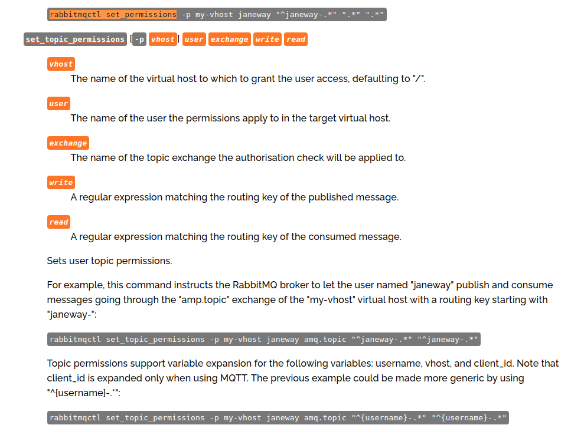
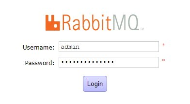

<br>

## Main

1. [Install Ubuntu 18.04.5 LTS SERVER](#download)
2. [Login to Storage Vm](#login)
3. [Add your rsa.pub on Storage Vm](#authorized_key)
4. [Create ssh config on Your Local PC](#ssh_config)
5. [Access to the Storage Vm via ssh](#ssh_access)
6. [Set static IP to Storage Vm](#set_static_ip_on_vm_storage)
7. [Install MongoDB](#k8s-storage-miro-mongoDB)
8. [Install PostgreSQL](#k8s-storage-miro-postgreSQL)
9. [Install MySql](#k8s-storage-miro-mysql)
10. [Install Redis](#k8s-storage-miro-redis)
11. [Install RabbitMq](#k8s-storage-miro-rabbitMq)
12. [ShutDown Storage Vm](#shutdown)

<br>

## Download

Download and install `Ubuntu 18.04.5 LTS SERVER` edition from [here](https://www.ubuntu-it.org/download).

[ [ back ] ](#main)

<br>

## Login


- k8s-storage-miro
  - username: YourStorageUsername
  - password: YourStoragePassword
  - ip `ifconfig: 3.3.3.3` YourStorageIP

[ [ back ] ](#main)

<br>

## Authorized_key

```bash
# storage
ssh k8s-storage-miro@3.3.3.3 # YourStorageVmIP
sudo su
k8sstoragemiro

# add ssh pub key on both
cd
vim .ssh/authorized_keys

### YourPub rsa
ssh-rsa **********************************
```

[ [ back ] ](#main)

<br>

## Ssh_config

On `local machine`

```bash
vim .ssh/config
```

```log
Host                k8s-storage-miro
Hostname            3.3.3.3
IdentityFile        ~/.ssh/id_rsa
IdentitiesOnly      yes
User                root
```

[ [ back ] ](#main)

<br>

## Ssh_access

```bash
ssh k8s-storage-miro
```

[ [ back ] ](#main)

<br>

## Set_static_ip_on_vm_storage

```bash
ifconfig -a
vim /etc/netplan/00-installer-config.yaml
sudo netplan apply
```

```yaml
# This is the network config written by 'subiquity'
network:
  version: 2
  renderer: networkd
  ethernets:
    ens33:
      dhcp4: no
      dhcp6: no
      addresses: [3.3.3.3/32]
      gateway4: YourGatewayIP
      nameservers:
        addresses: [8.8.8.8, 8.8.4.4]
```

`reach storage ip by hostname`

```bash
sudo vim /etc/hosts
3.3.3.3 k8s-storage-miro
```

[ [ back ] ](#main)

<br>

## k8s-storage-miro-mongoDB


- https://www.mongodb.com
- https://docs.mongodb.com/manual/tutorial/install-mongodb-on-ubuntu/

<br>

```bash
# ------- INSTALL -------

# Import the public key used by the package management system
wget -qO - https://www.mongodb.org/static/pgp/server-4.4.asc | sudo apt-key add -

# Create a list file
echo "deb [ arch=amd64,arm64 ] https://repo.mongodb.org/apt/ubuntu bionic/mongodb-org/4.4 multiverse" | sudo tee /etc/apt/sources.list.d/mongodb-org-4.4.list

# Reload local package database
sudo apt-get update

# Install the MongoDB packages
sudo apt-get install -y mongodb-org

# Optional. Although you can specify any available version of MongoDB, apt-get will upgrade the packages when a newer version becomes available. To prevent unintended upgrades, you can pin the package at the currently installed version:
echo "mongodb-org hold" | sudo dpkg --set-selections
echo "mongodb-org-server hold" | sudo dpkg --set-selections
echo "mongodb-org-shell hold" | sudo dpkg --set-selections
echo "mongodb-org-mongos hold" | sudo dpkg --set-selections
echo "mongodb-org-tools hold" | sudo dpkg --set-selections

# Run MongoDB Community Edition
sudo systemctl start mongod

#If you receive an error similar to the following when starting mongod: Failed to start mongod.service: Unit mongod.service not found. Run the following command first:
sudo systemctl daemon-reload # Then run the start command above again.

# Verify that MongoDB has started successfully.
sudo systemctl status mongod

# You can optionally ensure that MongoDB will start following a system reboot by issuing the following command:
sudo systemctl enable mongod

# Stop MongoDB
sudo systemctl stop mongod

# Restart MongoDB
sudo systemctl restart mongod

# Begin using MongoDB
mongo


# ------- ALLOW ACCESS FROM EXTERNAL -------

vim /etc/mongod.conf

net:
  port: 27017
  bindIpAll: true
#  bindIp: 127.0.0.1

sudo systemctl restart mongod
sudo netstat -tulpn | grep 27017

# Before tcp        0      0 127.0.0.1:27017         0.0.0.0:*               LISTEN      2390/mongod
# After  tcp        0      0 0.0.0.0:27017           0.0.0.0:*               LISTEN      2544/mongod


# ------- UNINSTALL -------

# Stop the mongod process by issuing the following command:
sudo service mongod stop

# Remove Packages
sudo apt-get purge mongodb-org*

# Remove Data Directories
sudo rm -r /var/log/mongodb
sudo rm -r /var/lib/mongodb

```

<br>

Download `MongoDB client`: [robo3t](https://robomongo.org/download)

[ [ back ] ](#main)

<br>

## k8s-storage-miro-postgreSQL


- https://www.postgresql.org
- https://www.postgresql.org/download/linux/ubuntu/
- https://linuxize.com/post/how-to-install-postgresql-on-ubuntu-18-04/

<br>

```bash

# ------- INSTALL -------

# Create the file repository configuration:
sudo sh -c 'echo "deb http://apt.postgresql.org/pub/repos/apt $(lsb_release -cs)-pgdg main" > /etc/apt/sources.list.d/pgdg.list'

# Import the repository signing key:
wget --quiet -O - https://www.postgresql.org/media/keys/ACCC4CF8.asc | sudo apt-key add -

# Update the package lists:
sudo apt-get update

# Install the latest version of PostgreSQL.
# If you want a specific version, use 'postgresql-12' or similar instead of 'postgresql':
sudo apt-get -y install postgresql

# Success. You can now start the database server using:
pg_ctlcluster 12 main start

# Verifying PostgreSQL Installation
sudo -u postgres psql -c "SELECT version();"


# ----- Creating PostgreSQL Role and Database ------

sudo -u postgres psql << EOF
CREATE USER miro WITH PASSWORD 'miro';
CREATE DATABASE mirodb;
GRANT CONNECT ON DATABASE mirodb TO miro;
\c mirodb
GRANT USAGE ON SCHEMA public TO miro;
GRANT SELECT, INSERT, UPDATE, DELETE ON ALL TABLES IN SCHEMA public TO miro;
GRANT ALL PRIVILEGES ON ALL TABLES IN SCHEMA public TO miro;
GRANT ALL PRIVILEGES ON ALL SEQUENCES IN SCHEMA public TO miro;
GRANT ALL PRIVILEGES ON DATABASE mirodb TO miro;
\q
EOF

# GRANT ALL PRIVILEGES ON TABLE public.tablename1 TO miro; ecc
# \i database/mirodb_1.0.0.sql ....


# ------- ALLOW ACCESS FROM EXTERNAL -------

# Enable remote access to PostgreSQL server
# By default, the PostgreSQL server listens only on the local interface 127.0.0.1.
# To enable remote access to your PostgreSQL server open the configuration file
# postgresql.# conf and add listen_addresses = '*' in the CONNECTIONS AND AUTHENTICATION section.
sudo vim /etc/postgresql/12/main/postgresql.conf

# - Connection Settings -
listen_addresses = '*'     # what IP address(es) to listen on;

# Save and Restart PostgreSQL
sudo service postgresql restart

# Verify the changes with the ss utility:
ss -nlt | grep 5432

# Before: LISTEN   0         128               127.0.0.1:5432             0.0.0.0:*
# After:  LISTEN   0         128                 0.0.0.0:5432             0.0.0.0:*
#         LISTEN   0         128                    [::]:5432                [::]:*

# The last step is to configure the server to accept remote connections by editing the pg_hba.conf file.
vim /etc/postgresql/12/main/pg_hba.conf

# The user miro will be able to access all databases from all locations using a md5 password
host    all             miro            0.0.0.0/0                md5
# The user miro will be able to access only the mirodb from all locations using a md5 password
#host    mirodb          miro            0.0.0.0/0                md5
# The user miro will be able to access all databases from a trusted location (4.4.4.4) without a password
#host    all             miro            4.4.4.4            trust


# ------- UNINSTALL -------

# Package list
dpkg -l | grep postgres

# Will get you the list of those packages that Postgres installed. Then, just use the same "apt-get --purge remove ...." command but instead of just postgresql, type each package name, separated by spaces, like:
sudo apt-get --purge remove postgresql # ... postgresql-doc postgresql-common

```

[ [ back ] ](#main)

<br>

## k8s-storage-miro-mysql


- https://linuxconfig.org/install-mysql-on-ubuntu-18-04-bionic-beaver-linux
- https://vitux.com/how-to-install-and-configure-mysql-in-ubuntu-18-04-lts/
- https://linuxize.com/post/how-to-install-mysql-on-ubuntu-18-04/

```bash

# ------- INSTALL -------

# First, update the apt package index by typing
sudo apt update

# Then install the MySQL package
sudo apt install mysql-server

# check whether the MySQL server is running and version
sudo systemctl status mysql
mysql --version

# Securing MySQL
sudo mysql_secure_installation

# To log in to the MySQL server as the root user
sudo mysql

# Check authentication method for MySQL users
mysql> SELECT user,authentication_string,plugin,host FROM mysql.user;

+------------------+-------------------------------------------+-----------------------+-----------+
| user             | authentication_string                     | plugin                | host      |
+------------------+-------------------------------------------+-----------------------+-----------+
| root             |                                           | auth_socket           | localhost |

# Change the authentication method for root
mysql> ALTER USER 'root'@'localhost' IDENTIFIED WITH mysql_native_password BY 'strong_password';

# Reload grant tables
mysql> FLUSH PRIVILEGES;

# Recheck authentication method for MySQL users
mysql> SELECT user,authentication_string,plugin,host FROM mysql.user;

+------------------+-------------------------------------------+-----------------------+-----------+
| user             | authentication_string                     | plugin                | host      |
+------------------+-------------------------------------------+-----------------------+-----------+
| root             | *7E1E5DB548BD5739A6E605AE21672A98CE13E1DD | mysql_native_password | localhost |

# Access
sudo mysql -p -u root # Miro@1985mysql

# Add new user and db to connecto from remote
mysql> CREATE USER 'miro'@'localhost' IDENTIFIED BY 'YourMySqlStrongPassword';
mysql> GRANT ALL PRIVILEGES ON *.* TO 'miro'@'localhost' WITH GRANT OPTION;
mysql> CREATE USER 'miro'@'%' IDENTIFIED BY 'YourMySqlStrongPassword';
mysql> GRANT ALL PRIVILEGES ON *.* TO 'miro'@'%' WITH GRANT OPTION;
mysql> FLUSH PRIVILEGES;
mysql> CREATE DATABASE mirodb;
#mysql> GRANT ALL ON mirodb.* TO 'miro'@'%' IDENTIFIED BY 'YourMySqlStrongPassword';
mysql> SELECT user,authentication_string,plugin,host FROM mysql.user;

+------------------+-------------------------------------------+-----------------------+-----------+
| user             | authentication_string                     | plugin                | host      |
+------------------+-------------------------------------------+-----------------------+-----------+
| miro             | *10B5CCD5670FA3C4DA4A5ADBF5DF8B21B24C098C | mysql_native_password | localhost |
| miro             | *10B5CCD5670FA3C4DA4A5ADBF5DF8B21B24C098C | mysql_native_password | %         |
+------------------+-------------------------------------------+-----------------------+-----------+

# Update specified host x user miro
mysql> UPDATE mysql.user SET host='4.4.4.4' WHERE user='miro';

# Delete user
mysql> DELETE FROM mysql.user WHERE user='miro';

# Exit
mysql> exit

# Start Mysql
sudo systemctl start mysql

# Stop Mysql
sudo systemctl stop mysql


# ------- ALLOW ACCESS FROM EXTERNAL -------

# If you wish to connect to your MySQL server remotely using MySQL client edit the /etc/mysql/mysql.conf.d/mysqld.cnf configuration:
sudo vim /etc/mysql/mysql.conf.d/mysqld.cnf
# and change the bind-address
# FROM: bind-address = 127.0.0.1
# TO: bind-address   = 0.0.0.0

# Reboot MySql server
sudo service mysql restart

# check
ss -nlt | grep 3306
# LISTEN   0         80                  0.0.0.0:3306             0.0.0.0:*


# ------- UNINSTALL -------

dpkg -l | grep mysql-server
sudo apt-get --purge remove mysql-server # ...

```

[ [ back ] ](#main)

<br>

## k8s-storage-miro-redis


- https://redis.io/
- https://linuxize.com/post/how-to-install-and-configure-redis-on-ubuntu-18-04/

<br>

```bash

# ------- INSTALL -------

# Start by updating the apt packages
sudo apt update

# Install Redis
sudo apt install redis-server

# Check the status of the service
sudo systemctl status redis-server


# ------- ALLOW ACCESS FROM EXTERNAL -------

# Locate the line that begins with bind 127.0.0.1 ::1 and replace 127.0.0.1 with 0.0.0.0.
sudo vim /etc/redis/redis.conf
# bind 0.0.0.0 ::1

# Restart the Redis service for changes to take effect
sudo systemctl restart redis-server

# Check Port
ss -an | grep 6379
#tcp  LISTEN 0   128   0.0.0.0:6379   0.0.0.0:*
#tcp  LISTEN 0   128      [::]:6379      [::]:*

# Next, you’ll need to add a firewall rule that enables traffic from your remote machines on TCP port 6379
sudo ufw allow proto tcp from 192.168.1.1/24 to any port 6379 # 192.168.121.0/24 change with your subnet

# Ping
redis-cli -h 3.3.3.3 ping


# ------- UNINSTALL -------

# if you use apt-get to install redis then use
sudo apt-get purge --auto-remove redis-server

# if you compiled redis manually then follow the
# steps below to remove it completely from linux/ubuntu
sudo service redis_version stop

# Now delete everything related to Redis server from /usr/local/bin/
sudo rm /usr/local/bin/redis-*

# Now delete Redis Configuration files directory and it’s content.
sudo rm -r /etc/redis/

# Delete existing Redis log files.
sudo rm /var/log/redis_*

# Delete existing Redis data directory and it’s content.
sudo rm -r /var/lib/redis/

# Delete existing Redis server init scripts
sudo rm /etc/init.d/redis_*

# Remove existing Redis PID files (Only if exists)
sudo rm /var/run/redis_*​

```

[ [ back ] ](#main)

<br>

## k8s-storage-miro-rabbitMq


- https://www.rabbitmq.com/
- https://www.rabbitmq.com/install-debian.html#apt
- https://computingforgeeks.com/how-to-install-latest-rabbitmq-server-on-ubuntu-linux/
- https://tecadmin.net/install-rabbitmq-server-on-ubuntu/
- https://www.rabbitmq.com/rabbitmqctl.8.html

<br>

```bash

# ------- INSTALL -------

# -----------------------------------------
# Install Erlang/OTP
# -----------------------------------------

# Import Erlang GPG Key
wget -O- https://packages.erlang-solutions.com/ubuntu/erlang_solutions.asc | sudo apt-key add -

# Ubuntu 18.04
echo "deb https://packages.erlang-solutions.com/ubuntu bionic contrib" | sudo tee /etc/apt/sources.list.d/rabbitmq.list

# Install
sudo apt update
sudo apt install erlang

# Check
erl

# -----------------------------------------
# Install RabbitMQ-Server
# -----------------------------------------

# Install RabbitMQ on Ubuntu : First of all, enable RabbitMQ PPA repository on your system. Also, import rabbitmq signing key on your system.
wget -O- https://dl.bintray.com/rabbitmq/Keys/rabbitmq-release-signing-key.asc | sudo apt-key add -
wget -O- https://www.rabbitmq.com/rabbitmq-release-signing-key.asc | sudo apt-key add -
echo "deb https://dl.bintray.com/rabbitmq/debian bionic main" | sudo tee /etc/apt/sources.list.d/rabbitmq.list

# After that update apt cache and install RabbitMQ server on your system
sudo apt-get update
sudo apt-get install rabbitmq-server

# Manage RabbitMQ Service
sudo systemctl enable rabbitmq-server
# Other cmd
sudo systemctl start rabbitmq-server
sudo systemctl stop rabbitmq-server
sudo systemctl status rabbitmq-server

# ------- ALLOW ACCESS FROM EXTERNAL -------

# Setup RabbitMQ Web Management Console
sudo rabbitmq-plugins enable rabbitmq_management
# RabbitMQ dashboard starts on port 15672. Access your server on the port to get the dashboard. Use the username and password created before

# Create Admin User in RabbitMQ
sudo rabbitmqctl add_user admin admin
sudo rabbitmqctl set_user_tags admin administrator
sudo rabbitmqctl set_permissions -p / admin ".*" ".*" ".*"

# Delete guest account
...


# ------- UNINSTALL -------


```

<br>



<br>

## rabbitMq login



<br>

`k8s-storage-miro rabbitmq`

- http://3.3.3.3:15672

```log
user: admin
pass: admin
```

[ [ back ] ](#main)

<br>

## shutdown

```bash
shutdown -h now
```

[ [ back ] ](#main)
